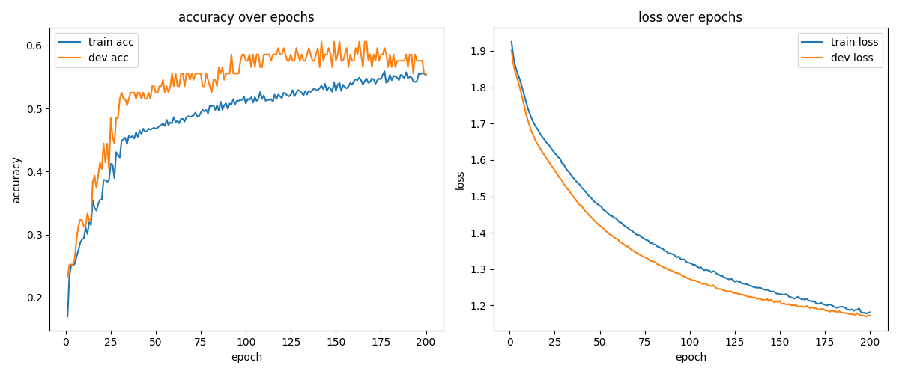

# Assignment 3: neural topic classification for Simplified Chinese

This project implements a multiclass topic classification pipeline for Simplified Chinese Wikipedia sentences. It uses **FastText** for character-based word embeddings and **PyTorch** for a feed-forward neural network for classification.

## Installation & Setup

1. Clone the repository:

   ```bash
   git clone <repository_url>
   cd <repository_name>
   ```

2. Install uv:
   This project uses [uv](https://docs.astral.sh/uv/) for dependency management.

   ```bash
   curl -LsSf https://astral.sh/uv/install.sh | sh
   ```

   *Or visit [the official installation page](https://docs.astral.sh/uv/getting-started/installation/) for other methods.*

3. Install dependencies:

   ```bash
   uv sync
   ```

   This will create a virtual environment and install all required libraries (torch, gensim, pandas, matplotlib, etc.).

## Usage

### Running the Pipeline

The entire process from training word embeddings to final evaluation is run via a shell script:

```bash
./run_pipeline.sh
```

*Note: The script uses `uv run` to ensure everything runs within the virtual environment.*

### Manual Execution

If you wish to run each script individually with full explicit parameters, please refer to [cli_commands.md](doc/cli_commands.md).

## Data Strategy (Latin characters and numbers)

To handle Latin characters (English words) and numbers, we use a regular expression (`r"[a-zA-Z0-9]+|[^\s]"`) to keep them whole as single tokens while splitting the surrounding Chinese text into individual characters. This preserves the semantic meaning of English words and numbers while maintaining the character-based approach for Chinese.

## Documentation

### Transcript

The code was run on MLTGPU server under `/scratch` storage. Please refer to the full [transcript](doc/transcript_mltgpu_scratch.txt).

### Confusion Matrix Observations

The model is great at predicting most of the categories, especially `science/technology` and `travel`. It completely fails at `health` and `entertainment`. In fact, it didn't guess `entertainment` at all.

It seems like the model defaults to `science/technology` and `travel` whenever it doesn't know the answer. This is due to the class imbalance where these two topics make up the majority of the training data.

### More Accurate Than Chance

There are 7 different labels in the dataset. There is a ~14.3% (1 out of 7) chance for a random guess to be correct.

According to the classification report, the model has an overall accuracy of 61%, which is way higher than 14.3%. Even for the macro and weighted average f1-score, they are 52% and 57%. This shows that the model is working and definitely performs more accurately than chance.

## Part Bonus 1 - Validation

